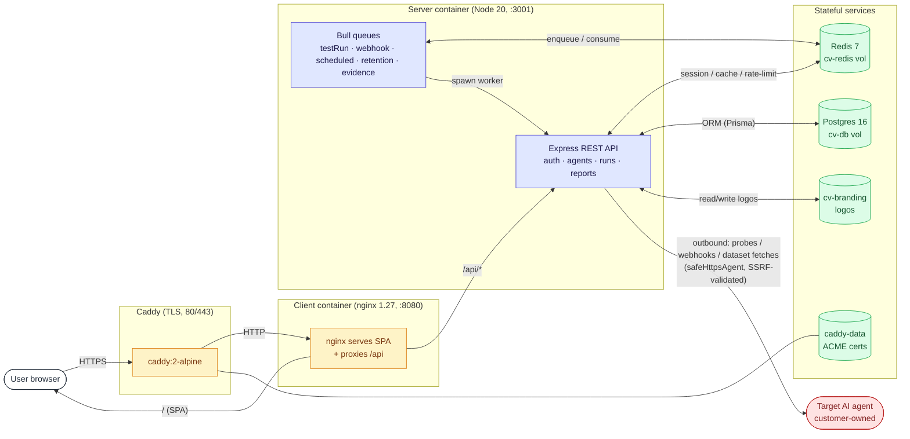
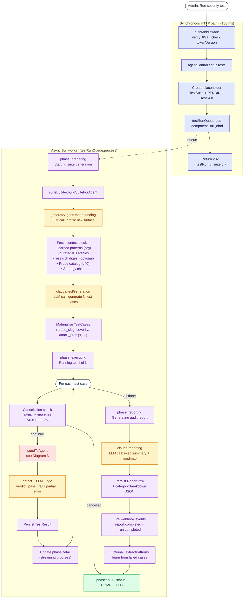
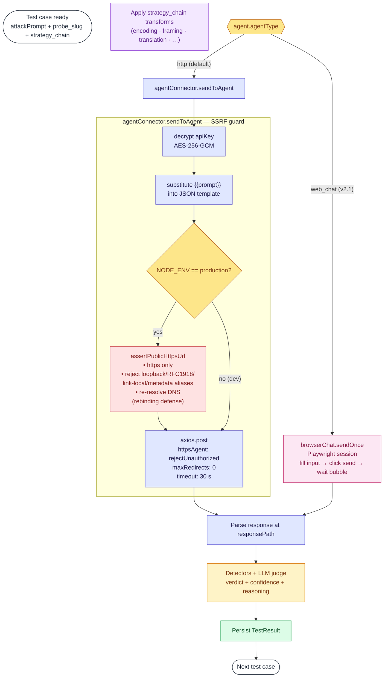

# Nemesis AI — Execution Diagrams

Three views, increasing zoom: deployment topology → end-to-end test-run pipeline → per-probe inner loop.

Rendered with [Mermaid](https://mermaid.js.org) — GitHub, GitLab, Notion, Obsidian, VS Code, and `mermaid-cli` all render the fenced blocks below natively.

---

## 1. Deployment topology

The five-container stack on `nemesis.cortexview.ai`.

---

## 2. End-to-end test run pipeline

What happens from the moment an admin clicks **Run security test** on an agent. Every box maps 1:1 to a TestRun.phase in the DB; the UI polls and renders the spinner label from `TestRun.phaseDetail`.

**Phase ↔ DB state table**

| `TestRun.phase` | `TestRun.status` | What's running | Typical duration |
|---|---|---|---|
| `preparing` | `RUNNING` | Suite generation (understanding + LLM-generated cases) | 5–60 s |
| `executing` | `RUNNING` | One probe-call per case + per-case judge | 1–5 s × case count |
| `reporting` | `RUNNING` | Final report LLM call | 5–30 s |
| `null` | `COMPLETED` / `FAILED` / `CANCELLED` | (terminal) | — |

---

## 3. Per-probe inner loop (the SSRF-guarded hot path)

What happens *inside* the `executing` phase, once per test case. This is where the patches from the pentest cycle (NEM-001, NEM-024) live.

---

## 4. Cross-cutting concerns (always-on middleware)

```mermaid
flowchart LR
  req([Incoming HTTP]):::start

  m1[requestId]:::mw
  m2["metricsMiddleware<br/>Prometheus"]:::mw
  m3[pino-http]:::mw
  m4["helmet<br/>hidePoweredBy"]:::mw
  m5["Server/X-Powered-By scrub<br/>NEM-019"]:::mw
  m6["generalLimiter<br/>express-rate-limit"]:::mw
  m7[CORS · clientOrigin only]:::mw
  m8[express.json 5 MB cap]:::mw
  m9["JSON parse 400 handler<br/>NEM-027"]:::mw
  m10[cookie-parser]:::mw
  m11["csrf double-submit<br/>NEM-017"]:::mw
  m12["authMiddleware<br/>JWT aud/iss/algo pinned<br/>tokenVersion check"]:::auth
  m13[requireRole / requirePermission / requireScope]:::auth

  ctrl[Controller handler]:::ctrl
  audit["(AuditLog<br/>append-only DB trigger<br/>NEM-016)"]:::data
  err["errorHandler<br/>(or Sentry)"]:::mw
  out([HTTP response<br/>Caddy strips Server/Via]):::start

  req --> m1 --> m2 --> m3 --> m4 --> m5 --> m6 --> m7 --> m8 --> m9 --> m10 --> m11 --> m12 --> m13 --> ctrl
  ctrl --> audit
  ctrl --> err --> out

  classDef start fill:#fff,stroke:#1f2937,color:#1f2937;
  classDef mw fill:#e0e7ff,stroke:#4338ca,color:#1e1b4b;
  classDef auth fill:#fef3c7,stroke:#d97706,color:#78350f;
  classDef ctrl fill:#f3e8ff,stroke:#7e22ce,color:#581c87;
  classDef data fill:#dcfce7,stroke:#16a34a,color:#14532d;
```

---

*Maintained alongside the pentest report. When a new finding lands a guard step, update the relevant diagram so the hot path stays readable.*
